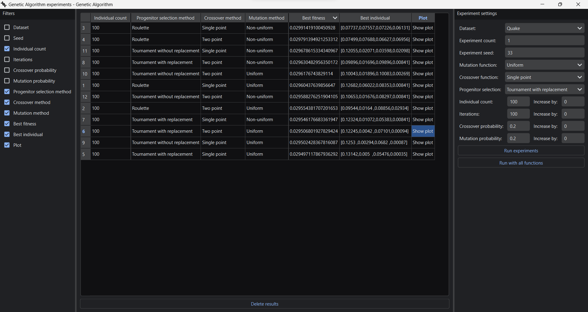

# Genetic Algorithm

This is a simple GUI program that runs genetic algorithm experiments on CSV datasets. 

It is coded in Python, using PySide6 for the GUI and NumPy for the array operations.

# How to use it

- Install dependencies:

`pip install -r requirements.txt`

- Run program

`python main.py`

